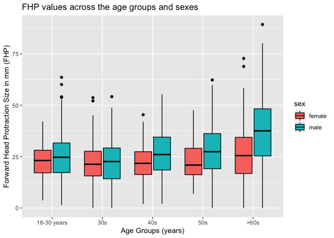
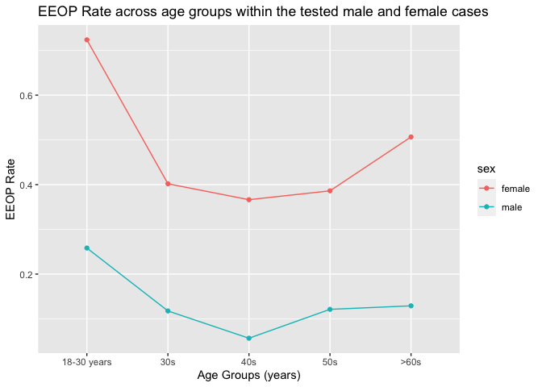

p8105\_mtp\_yz4187
================
Yiwen Zhao
10/29/2021

### Introduction

This project will use the correction data used in the report describing
the relationship between posture and “enlarged protuberances” among
young people which published in 2018 Nature Scientific Reports and try
to find out a new analysis on the relationship through the new
correction data.

### Problem 1 - Data

``` r
df = read_excel("p8105_mtp_data.xlsx", range = "A9:I1230") %>%
  janitor::clean_names()
df$eop_size_mm[is.na(df$eop_size_mm)] = 0
df$eop_shape[is.na(df$eop_shape)] = mean(df$eop_shape,na.rm = TRUE)
df$fhp_size_mm[is.na(df$fhp_size_mm)] = mean(df$fhp_size_mm,na.rm = TRUE)
sum(is.na(df))
```

    ## [1] 0

``` r
df %>%
  mutate(sex = ifelse(sex == 0,"female", "male"),
         eop_detected = ifelse(eop_size_mm == 0, "0","1")) %>%
  select(sex, age_group, eop_size, fhp_category, eop_detected) %>%
  group_by(sex) %>%
  summarise(n = n(),
            ) %>%
  arrange(desc(n)) %>%
  knitr::kable()
```

| sex    |   n |
|:-------|----:|
| female | 614 |
| male   | 607 |

``` r
df %>%
  mutate(sex = ifelse(sex == 0,"female", "male"),
         eop_detected = ifelse(eop_size_mm == 0, "0","1"),
         age_group = fct_collapse(age_group, "6" = c("6","7","8"))
         ) %>%
  select(sex, age_group, eop_size, fhp_category, eop_detected) %>%
  group_by(age_group) %>%
  summarise(n = n()) %>%
  arrange(desc(n)) %>%
  knitr::kable()
```

| age\_group |   n |
|:-----------|----:|
| 6          | 305 |
| 2          | 303 |
| 4          | 207 |
| 3          | 204 |
| 5          | 200 |
| 1          |   2 |

**Description:** The data cleaning process starts with replacing all the
na with either a zero (since the missing eop\_size(mm) in the dataset is
0) or the mean value (since the mean value will not affect the results
of following calculations). The key variables are sex, age\_group,
eop\_size, fhp\_category. One categorical variable “eop\_detected” has
been added to the data table to define whether the eop is detected.
There are 1221 participants in total, and there are 614 females and 607
males. The the most participants are in the 18-30 age group, and 914
participants are under 60.

### Problem 2 - Visualization

``` r
df %>%
  filter(age_group > 1) %>%
  mutate(sex = ifelse(sex == 0,"female", "male"),
         age_group = fct_collapse(age_group, "6" = c("6","7","8"))) %>%
  ggplot(aes(x = age_group, y = fhp_size_mm, fill = sex)) + geom_boxplot(colour = "black") +
  scale_x_discrete(
    labels = c("18-30 years","30s","40s","50s",">60s")) +
  labs(
    title = "FHP values across the age groups and sexes",
    x = "Age Groups (years)",
    y = "Forward Head Protraction Size in mm (FHP)"
    )
```

<!-- -->

``` r
eeop_df_m = df %>%
  filter(eop_size_mm > 10, sex == 0, age_group > 1) %>%
  mutate(sex = ifelse(sex == 0,"female", "male"),
         age_group = fct_collapse(age_group, "6" = c("6","7","8"))
         ) %>%
  select(sex, age_group, eop_size_mm) %>%
  group_by(age_group) %>%
  summarise(n = n()) %>%
  arrange(age_group)
```

    ## Warning: Unknown levels in `f`: 8

``` r
eeop_df_f = df %>%
  filter(eop_size_mm > 10, sex == 1, age_group > 1) %>%
  mutate(sex = ifelse(sex == 0,"female", "male"),
         age_group = fct_collapse(age_group, "6" = c("6","7","8"))
         ) %>%
  select(sex, age_group, eop_size_mm) %>%
  group_by(age_group) %>%
  summarise(n = n()) %>%
  arrange(age_group)
```

    ## Warning: Unknown levels in `f`: 8

``` r
eeop_df = full_join(eeop_df_m,eeop_df_f, by = "age_group")
names(eeop_df) = c("age_group", "male", "female")

eop_df_m = df %>%
  filter(age_group > 1, sex == 0) %>%
  mutate(sex = ifelse(sex == 0,"female", "male"),
         age_group = fct_collapse(age_group, "6" = c("6","7","8"))
         ) %>%
  select(sex, age_group, eop_size_mm) %>%
  group_by(age_group) %>%
  summarise(n = n()) %>%
  arrange(age_group) 

eop_df_f = df %>%
  filter(age_group > 1, sex == 1) %>%
  mutate(sex = ifelse(sex == 0,"female", "male"),
         age_group = fct_collapse(age_group, "6" = c("6","7","8"))
         ) %>%
  select(sex, age_group, eop_size_mm) %>%
  group_by(age_group) %>%
  summarise(n = n()) %>%
  arrange(age_group) 
```

    ## Warning: Unknown levels in `f`: 8

``` r
eop_df = full_join(eop_df_m,eop_df_f, by = "age_group")
names(eop_df) = c("age_group", "male", "female")

join_df = full_join(eeop_df,eop_df, by = "age_group")
rate_df = mutate(join_df, eeop_rate_male = male.x / male.y, eeop_rate_female = female.x/female.y)

mdf =
  rate_df %>%
  select(age_group,eeop_rate_male) %>%
  mutate(sex = "male") %>%
  rename("eeop_rate" = "eeop_rate_male")
fdf =
  rate_df %>%
  select(age_group,eeop_rate_female) %>%
  mutate(sex = "female") %>%
  rename("eeop_rate" = "eeop_rate_female")

rate_df = 
  rbind(mdf,fdf)
rate_df
```

    ## # A tibble: 10 × 3
    ##    age_group eeop_rate sex   
    ##    <fct>         <dbl> <chr> 
    ##  1 2            0.258  male  
    ##  2 3            0.118  male  
    ##  3 4            0.0566 male  
    ##  4 5            0.121  male  
    ##  5 6            0.129  male  
    ##  6 2            0.724  female
    ##  7 3            0.402  female
    ##  8 4            0.366  female
    ##  9 5            0.386  female
    ## 10 6            0.507  female

``` r
rate_df %>%
  ggplot(aes(x = age_group, y = eeop_rate, group = sex, color = sex)) + geom_line() + geom_point() +
  scale_x_discrete(
    labels = c("18-30 years","30s","40s","50s",">60s")) +
  labs(
    title = "EEOP Rate across age groups within the tested male and female cases",
    x = "Age Groups (years)",
    y = "EEOP Rate"
    )
```

<!-- -->

``` r
wordcountaddin::text_stats("p8105_mtp_yz4187.Rmd")
```

| Method          | koRpus      | stringi       |
|:----------------|:------------|:--------------|
| Word count      | 154         | 144           |
| Character count | 940         | 940           |
| Sentence count  | 7           | Not available |
| Reading time    | 0.8 minutes | 0.7 minutes   |
