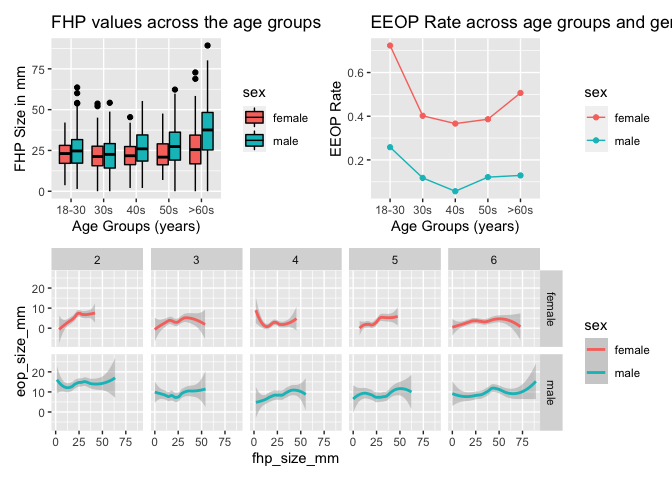

p8105\_mtp\_yz4187
================
Yiwen Zhao
10/29/2021

### Introduction

This project uses the correction data describing the relationship
between posture and “enlarged protuberances” among people and makes new
data analysis on relationships among different variables.

### Problem 1 - Data

``` r
df = read_excel("p8105_mtp_data.xlsx", range = "A9:I1230") %>%
  janitor::clean_names()
df$eop_size_mm[is.na(df$eop_size_mm)] = 0
df$eop_shape[is.na(df$eop_shape)] = mean(df$eop_shape,na.rm = TRUE)
df$fhp_size_mm[is.na(df$fhp_size_mm)] = mean(df$fhp_size_mm,na.rm = TRUE)
sum(is.na(df))
```

    ## [1] 0

``` r
df %>%
  mutate(sex = ifelse(sex == 0,"female", "male"),
         eop_detected = ifelse(eop_size_mm == 0, "0","1")) %>%
  select(sex, age_group, eop_size, fhp_category, eop_detected) %>%
  group_by(sex) %>%
  summarise(n = n(),
            ) %>%
  arrange(desc(n)) %>%
  knitr::kable()
```

| sex    |   n |
|:-------|----:|
| female | 614 |
| male   | 607 |

``` r
df %>%
  mutate(sex = ifelse(sex == 0,"female", "male"),
         eop_detected = ifelse(eop_size_mm == 0, "0","1"),
         age_group = fct_collapse(age_group, "6" = c("6","7","8"))
         ) %>%
  select(sex, age_group, eop_size, fhp_category, eop_detected) %>%
  group_by(age_group) %>%
  summarise(n = n()) %>%
  arrange(desc(n)) %>%
  knitr::kable()
```

| age\_group |   n |
|:-----------|----:|
| 6          | 305 |
| 2          | 303 |
| 4          | 207 |
| 3          | 204 |
| 5          | 200 |
| 1          |   2 |

**Description:** The data cleaning process starts with replacing NAs
with either a zero (since the missing eop\_size(mm) in the dataset is 0)
or the mean value (since the mean value will not affect the results of
following calculations). Key variables are sex, age\_group, eop\_size,
fhp\_size. One categorical variable “eop\_detected” has been added to
the data table to define participants who have eop. There are 1221
participants in total(614 females, 607 males). The most participants are
in 18-30 age group, and 914 participants are under 60.

### Problem 2 - Visualization

``` r
fhp_plot = 
  df %>%
  filter(age_group > 1) %>%
  mutate(sex = ifelse(sex == 0,"female", "male"),
         age_group = fct_collapse(age_group, "6" = c("6","7","8"))) %>%
  ggplot(aes(x = age_group, y = fhp_size_mm, fill = sex)) + geom_boxplot(colour = "black") +
  scale_x_discrete(
    labels = c("18-30","30s","40s","50s",">60s")) +
  labs(
    title = "FHP values across the age groups and genders",
    x = "Age Groups (years)",
    y = "FHP Size in mm"
    )
```

``` r
eeop_df_m = df %>%
  filter(eop_size_mm > 10, sex == 0, age_group > 1) %>%
  mutate(sex = ifelse(sex == 0,"female", "male"),
         age_group = fct_collapse(age_group, "6" = c("6","7","8"))
         ) %>%
  select(sex, age_group, eop_size_mm) %>%
  group_by(age_group) %>%
  summarise(n = n()) %>%
  arrange(age_group)

eeop_df_f = df %>%
  filter(eop_size_mm > 10, sex == 1, age_group > 1) %>%
  mutate(sex = ifelse(sex == 0,"female", "male"),
         age_group = fct_collapse(age_group, "6" = c("6","7","8"))
         ) %>%
  select(sex, age_group, eop_size_mm) %>%
  group_by(age_group) %>%
  summarise(n = n()) %>%
  arrange(age_group)

eeop_df = full_join(eeop_df_m,eeop_df_f, by = "age_group")
names(eeop_df) = c("age_group", "male", "female")

eop_df_m = df %>%
  filter(age_group > 1, sex == 0) %>%
  mutate(sex = ifelse(sex == 0,"female", "male"),
         age_group = fct_collapse(age_group, "6" = c("6","7","8"))
         ) %>%
  select(sex, age_group, eop_size_mm) %>%
  group_by(age_group) %>%
  summarise(n = n()) %>%
  arrange(age_group) 

eop_df_f = df %>%
  filter(age_group > 1, sex == 1) %>%
  mutate(sex = ifelse(sex == 0,"female", "male"),
         age_group = fct_collapse(age_group, "6" = c("6","7","8"))
         ) %>%
  select(sex, age_group, eop_size_mm) %>%
  group_by(age_group) %>%
  summarise(n = n()) %>%
  arrange(age_group) 

eop_df = full_join(eop_df_m,eop_df_f, by = "age_group")
names(eop_df) = c("age_group", "male", "female")

join_df = full_join(eeop_df,eop_df, by = "age_group")
combine_df = mutate(join_df, eeop_rate_male = male.x / male.y, eeop_rate_female = female.x/female.y)

mdf =
  combine_df %>%
  select(age_group,eeop_rate_male) %>%
  mutate(sex = "male") %>%
  rename("eeop_rate" = "eeop_rate_male")
fdf =
  combine_df %>%
  select(age_group,eeop_rate_female) %>%
  mutate(sex = "female") %>%
  rename("eeop_rate" = "eeop_rate_female")

rate_df = 
  rbind(mdf,fdf)
rate_df
```

    ## # A tibble: 10 × 3
    ##    age_group eeop_rate sex   
    ##    <fct>         <dbl> <chr> 
    ##  1 2            0.258  male  
    ##  2 3            0.118  male  
    ##  3 4            0.0566 male  
    ##  4 5            0.121  male  
    ##  5 6            0.129  male  
    ##  6 2            0.724  female
    ##  7 3            0.402  female
    ##  8 4            0.366  female
    ##  9 5            0.386  female
    ## 10 6            0.507  female

``` r
eeop_plot = 
  rate_df %>%
  ggplot(aes(x = age_group, y = eeop_rate, group = sex, color = sex)) + geom_line() + geom_point() +
  scale_x_discrete(
    labels = c("18-30","30s","40s","50s",">60s")) +
  labs(
    title = "EEOP Rate across age groups and genders",
    x = "Age Groups (years)",
    y = "EEOP Rate"
    )
```

``` r
fhp_eop_plot = 
  df %>%
  filter(age_group > 1) %>%
  mutate(sex = ifelse(sex == 0,"female", "male"),
         age_group = fct_collapse(age_group, "6" = c("6","7","8"))
         ) %>%
  ggplot(aes(x = fhp_size_mm, y = eop_size_mm, color = sex)) +
  geom_smooth(se = TRUE) + 
  facet_grid(sex ~ age_group)

(fhp_plot + eeop_plot) / fhp_eop_plot
```

<!-- -->

### Problem 3 - Reproducing reported result

``` r
df %>%
  mutate(sex = ifelse(sex == 0,"female", "male"),
         age_group = fct_collapse(age_group, "6" = c("6","7","8"))) %>%
  select(sex, age_group, eop_size) %>%
  group_by(age_group) %>%
  summarise(n = n()) %>%
  arrange(desc(n)) %>%
  knitr::kable()
```

| age\_group |   n |
|:-----------|----:|
| 6          | 305 |
| 2          | 303 |
| 4          | 207 |
| 3          | 204 |
| 5          | 200 |
| 1          |   2 |

``` r
fhp_mean = mean(df$fhp_size_mm,na.rm = TRUE)
fhp_sd = sd(df$fhp_size_mm)
print(fhp_mean)
```

    ## [1] 26.10134

``` r
print(fhp_sd)
```

    ## [1] 12.9735

``` r
df %>%
  filter(eop_size_mm >= 10) %>%
  mutate(sex = ifelse(sex == 0,"female", "male"),
         age_group = fct_collapse(age_group, "6" = c("6","7","8"))) %>%
  select(sex, age_group, eop_size) %>%
  group_by(age_group) %>%
  summarise(n = n()) %>%
  arrange(age_group) %>%
  knitr::kable() 
```

| age\_group |   n |
|:-----------|----:|
| 2          | 149 |
| 3          |  53 |
| 4          |  44 |
| 5          |  51 |
| 6          |  96 |

``` r
df %>%
  filter(eop_size_mm > 0) %>%
  mutate(sex = ifelse(sex == 0,"female", "male"),
         age_group = fct_collapse(age_group, "6" = c("6","7","8"))) %>%
  select(sex, age_group, eop_size) %>%
  group_by(age_group) %>%
  summarise(n = n()) %>%
  arrange(age_group) %>%
  knitr::kable() 
```

| age\_group |   n |
|:-----------|----:|
| 1          |   1 |
| 2          | 221 |
| 3          | 115 |
| 4          |  96 |
| 5          | 104 |
| 6          | 165 |

``` r
eeop_prevalence = (149 + 53 + 44 + 51 + 96)/(1 + 221 + 115 + 96 + 104 + 165)
print(eeop_prevalence)
```

    ## [1] 0.5598291

``` r
df %>%
  filter(fhp_size_mm > 40, age_group >= 6) %>%
  mutate(sex = ifelse(sex == 0,"female", "male"),
         age_group = fct_collapse(age_group, "6" = c("6","7","8"))) %>%
  group_by(age_group) %>%
  summarise(n = n()) 
```

    ## # A tibble: 1 × 2
    ##   age_group     n
    ##   <fct>     <int>
    ## 1 6            99

``` r
df %>%
  filter(fhp_size_mm > 0, age_group >= 6) %>%
  mutate(sex = ifelse(sex == 0,"female", "male"),
         age_group = fct_collapse(age_group, "6" = c("6","7","8"))) %>%
  group_by(age_group) %>%
  summarise(n = n())
```

    ## # A tibble: 1 × 2
    ##   age_group     n
    ##   <fct>     <int>
    ## 1 6           301

``` r
FHP_prevalence = (99)/(301)
print(FHP_prevalence)
```

    ## [1] 0.3289037

**Answer:** The authors’ stated sample sizes are not consistent with the
our sample sizes, but the difference is not obvious.The sample size we
have is: 18–30 n=303, 31–40 n=204, 41–50 n=207, 51–60 n=200 and &gt;60
n=305. The mean of FHP is approximately consistent with the authors’
data. EEOP is the enlarged EOP which have exceeded 10 mm in size. we can
use EEOP\_size\_mm, age\_group and number of participants to evaluate
this claim. The prevalence of EEOP is 55.98% and is not consistent with
the authors’ data.The FHP is more common in older subjects. From our
data, the FHP&gt;40mm is observed 32.89% in &gt;60s cases, which is less
than the authors’ result.

### Problem 4 - Discussion

    Comparing to our new data analysis, the original report is less accurate since its results are not completely consistent with our results even though the difference is not big. The authors' report is not clear enough to provide evidence that cell phones are causing horn growth since their graphs have not shown clear relationship between cell phone use and EOP/FNP. We got a higher prevalence of EEOP(58.98%) and a little lower prevalence of FHP>40mm than authors' data. According to our graphs and analysis, we can clearly see the relationships how FHP size, age, sex and EOP size are related to each other. Males and older age groups have more possibilities to get larger FHP than younger people and women, but the relationship between EOP size and FHP size is not very clear. With using EEOP rate, we find more accurate conclusion that both young age groups and age over 60s have a higher rate of EEOP. People who are over 60s are also more likely to have FHP than younger people. Thus, there is no clear evidence shows that younger people may have higher possibilities to get enlarged protuberances. To address the relationship between phone using and "horn" growth, we still need data on frequencies or total time each day people using phones in different age groups and genders.

``` r
wordcountaddin::text_stats("p8105_mtp_yz4187.Rmd")
```

| Method          | koRpus      | stringi       |
|:----------------|:------------|:--------------|
| Word count      | 493         | 452           |
| Character count | 2807        | 2807          |
| Sentence count  | 29          | Not available |
| Reading time    | 2.5 minutes | 2.3 minutes   |
